% Virtual Machine Setup with CentOS 7

We will need a CentOS 7 VM to run the examples and source code described
in the book. A CentOS 7 VM can be setup either by using any of the cloud
providers like Google Compute Engine, AWS, Rackspace, etc., or by using
a local VirtualBox installation as described below. Once the CentOS 7 VM
is setup it will need to be configured as described in [Section 3 -
CentOS 7 VM Configuration](#centos-7-vm-configuration)

Basic specifications of the VM required are given below:

1.  Operation System – CentOS 7 64-bit

2.  RAM – min 6 GB, 8 GB recommended

3.  Cores – min 4 cores, 8 cores recommended

4.  Hard Disk Storage Size – 40 GB

Virtual Box Installation
========================

1.  Download VirtualBox from the link below and install it, as per your
    operating system (64-bit operating system required). Please follow
    through the setup instructions in installation wizard.

    <https://www.virtualbox.org/wiki/Downloads>

2.  Once installed, launch VirtualBox, to configure the CentOS 7 VM, as
    explained in the following section

CentOS 7 VM Setup with VirtualBox
=================================

1.  Download the CentOS 7 installation DVD from any of the CentOS 7
    mirror sites. You may also download the CentOS 7 installation DVD
    from the link below.

    [*http://isoredirect.centos.org/centos/7/isos/x86\_64/CentOS-7-x86\_64-DVD-1611.iso*](http://isoredirect.centos.org/centos/7/isos/x86_64/CentOS-7-x86_64-DVD-1611.iso)

2.  Create a VM by clicking on NEW icon in toolbar. This will initiate
    the process of VM creation in VIrtualBox

    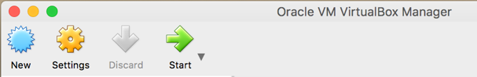

3.  Provide Name for the VM, as shown below and click on continue

    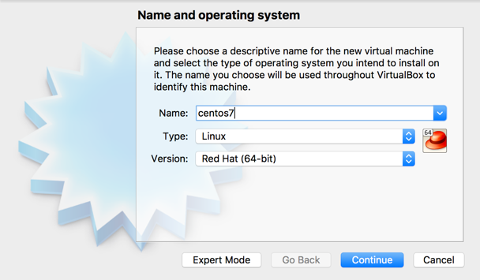

4.  Configure memory for the VM to a level between 5GB – 8GB (8GB
    recommended) and continue

    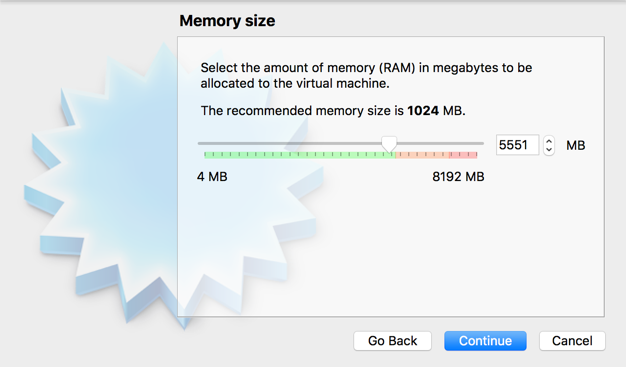

5.  Next the setup would navigate to creation of disk as shown below.
    Select **Create a virtual hard disk now** as shown below, and click
    on **Create**.

    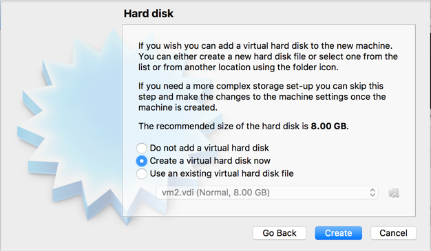

6.  This will navigate into series of questions around storage, the
    first prompt is shown as below. Here you may select VDI (default)
    and click on continue

    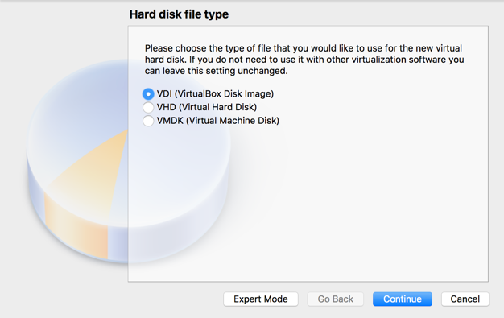

7.  On the next prompt, keep the default selection, i.e. Dynamically
    Allocated and click on continue

    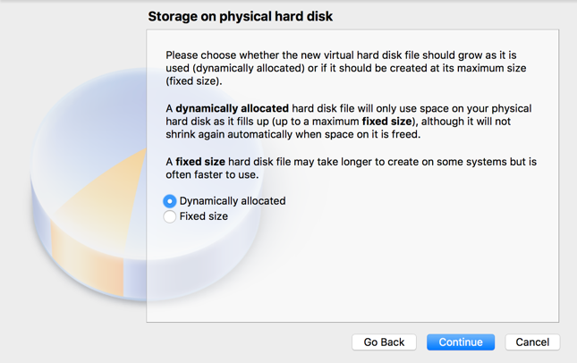

8.  On the final prompt, configure a size of 40GB as shown below and
    click on Create that would create the VM with the requested
    configurations.

    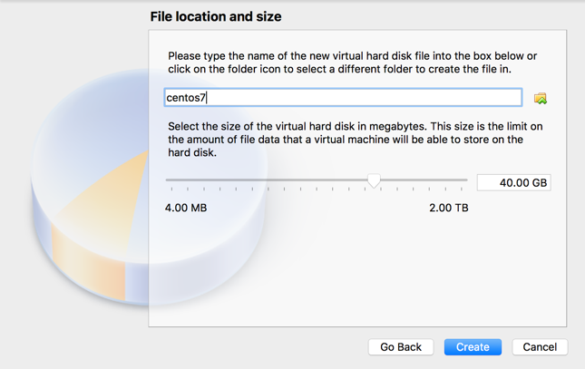

9.  Select the created VM, and click on **Settings** menu

    

10. Navigate to Storage Tab, to configure the optical drive by clicking
    on the **Empty** disk icon and then clicking on Optical Disk icon on
    the right-hand side for specifying CentOS 7 DVD ISO downloaded.

    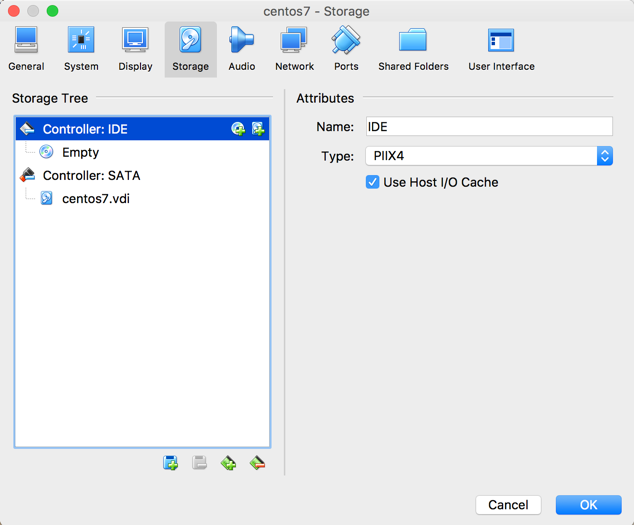

    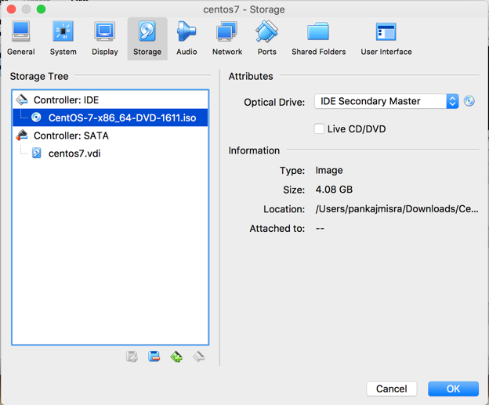

11. Open the network tab, to configure the network. The VM network must
    be a Bridged Network, with other configurations as shown below.
    Click on **OK** once done.

    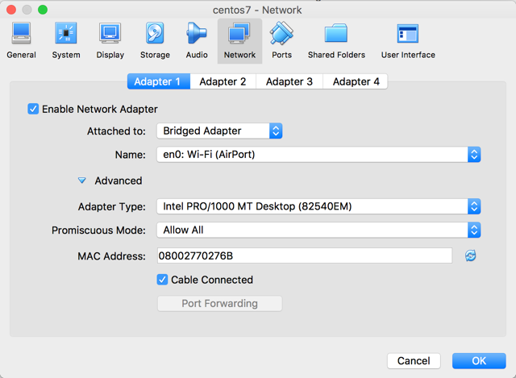

12. Start the CentOS 7 VM by clicking on **Start | Normal**

    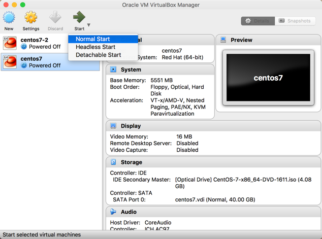

13. Once the VM starts, the initial boot options would be displayed.
    Select **Install CentOS Linux 7** and hit ENTER

    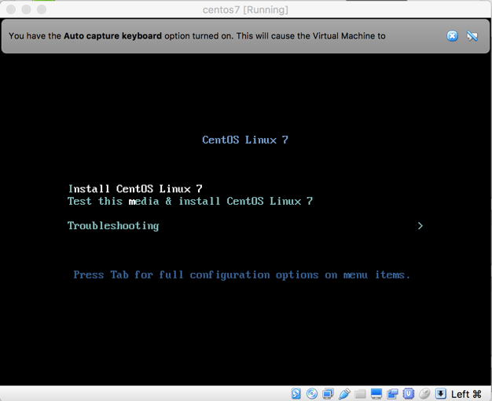

14. Once the installation is initiated, the CentOS 7 installation wizard
    would go step-by-step, initial step being the language setting, as
    shown below. Once the language is selected, click on **CONTINUE**.

    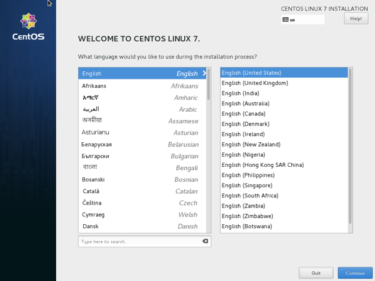

15. In the next step, CentOS 7 installation wizard will show things to
    be set. Out of all the things shown, please set the Date and the
    Install Destianation as shown below.

16. On navigating to Date and Time setting, you may select your local
    time zone as shown below and click on **DONE**.

    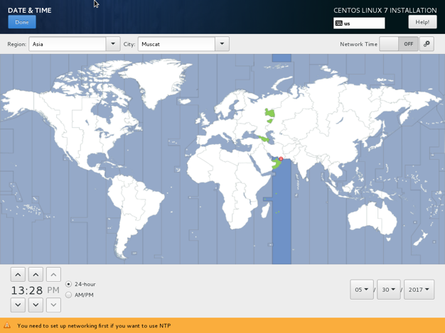

17. When we click on **Installation Destination**, the wizard will present
    the option of 40 GB HDD which needs to be clicked for selection, and
    proceed ahead by clicking on DONE.

    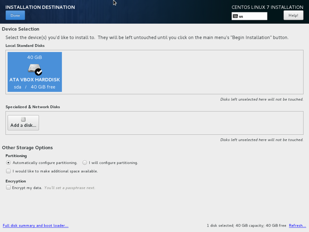

18. The installation of CentOS 7 will commence now, and in parallel, the
    root user password and additional user can be configured, as shown
    in the snapshots below.

    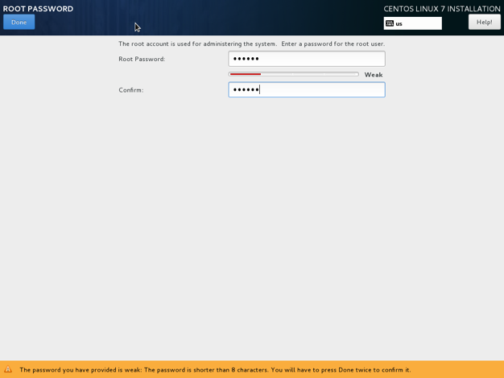

    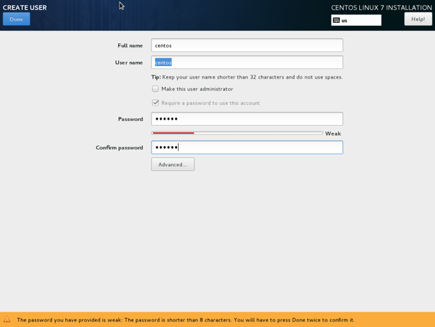

19. Once the installation completes, CentOS 7 installation wizard will
    show up **Reboot** button which needs to be clicked for CentOS VM to
    restart in normal mode.

    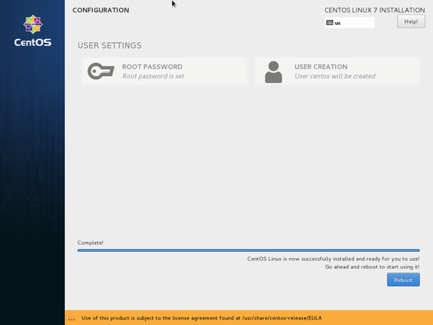

20. Once the VM restarts, and prompts for user login, login with root
    user credentials, as setup during the installation process as we
    need to configure certain system level parameters

CentOS 7 VM Configuration
=========================

This section describes how to configure the CentOS 7 VM to make it fit
for the purpose of running examples in the book. This is required to be
done irrespective of whether the CentOS 7 VM has been instantiated using
a Cloud Provider or by local VirtualBox Setup.

For CentOS 7 VM Setup with Cloud Providers (AWS, Google Compute Engine, Rackspace, etc.)
----------------------------------------------------------------------------------------

If the CentOS 7 VM was instantiated using any of the cloud providers,
the VM may only have root user configured. In order to create a non-root
user (centos/centos in this case), you may use the following commands,
after login with root user

1.  To create a user

    *useradd centos*

2.  Set password for new user

    *passwd centos*

Common Configuration Steps
--------------------------

Now lets us follow the steps below to complete configuration for CentOS
7 VM.

1.  After login with root user, configure the network interface with vi
    editor, by using following command

> vi /etc/sysconfig/network-scripts/ifcfg-enp0s3

Set the parameters highlighted below. Out of the default values,
configure ONBOOT to yes, and add additional property of IPV4\_IPADDRESS
as yes.

> TYPE=Ethernet
>
> BOOTPROTO=dhcp
>
> DEFROUTE=yes
>
> PEERDNS=yes
>
> PEERROUTES=yes
>
> IPV4\_FAILURE\_FATAL=no
>
> **IPV4\_IPADDRESS=yes**
>
> IPV6INIT=yes
>
> IPV6\_AUTOCONF=yes
>
> IPV6\_DEFROUTE=yes
>
> IPV6\_PEERDNS=yes
>
> IPV6\_PEERROUTES=yes
>
> IPV6\_FAILURE\_FATAL=no
>
> IPV6\_ADDR\_GEN\_MODE=stable-privacy
>
> NAME=enp0s3
>
> UUID=7d1f4bf8-08c7-4f88-9f94-4aa86df89069
>
> DEVICE=enp0s3
>
> **ONBOOT=yes**

2.  Configure the system limits by editing the limits.conf using the
    following command

> vi /etc/security/limits.conf

Append the following lines at the end of the file.

> \*               soft    nproc           65536
>
> \*               hard    nproc           65536
>
> \*               soft    nofile          65536
>
> \*               hard    nofile          65536

3.  Configure the vm maps limits by editing the sysctl.conf file with
    following command and adding the the required configuration as
    specified below.

> vi /etc/sysctl.conf

Add the following configuration at the end of the file.

vm.max\_map\_count = 262144

4.  Configure the non-root user (centos in this case) as a sudo user by
    editing sudoers file with following command

> vi /etc/sudoers

Add the following highlighted line to the sudoers file

> \#\# Allow root to run any commands anywhere 
>
> root ALL=(ALL) ALL
>
> **centos ALL=(ALL) NOPASSWD: ALL**

5.  Disable the firewall with following commands

> systemctl stop firewalld

systemctl disable firewalld

6.  Reboot the CentOS VM using the following command

reboot

7.  Once the VM is up and running login using non-root user. This
    non-root user will be our primary user account for all
    actions/operations as described in the book. For any system level
    activity, the command may be prefixed with sudo, for instance for
    running yum command to list all installed packages it would be,
    *sudo yum list*

This completes the basic setup required for CentOS 7 VM in order to run
the source code and examples described in the book
